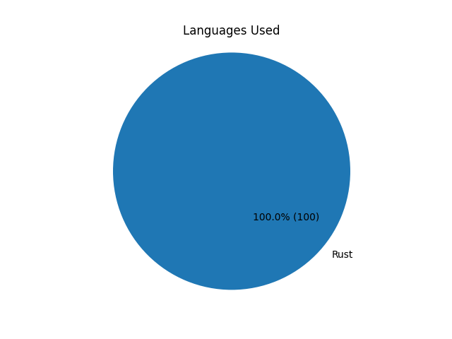

# kattis_problems

Solutions to kattis exercises found on https://open.kattis.com

Each folder indicates what programming language the solution was created with.

Each Solution might be done multiple times in different languages.

The following graph gives you an overview of which languages have been used and for how many:

